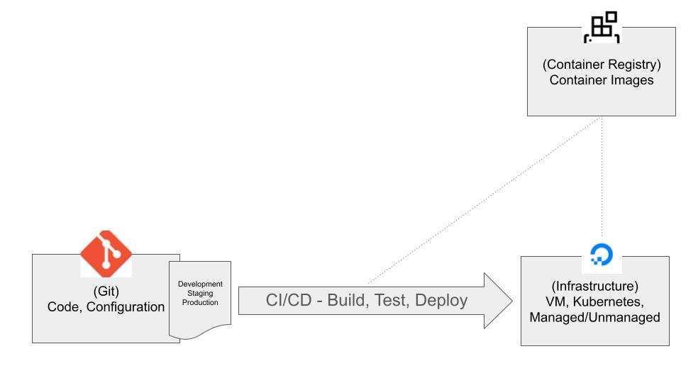
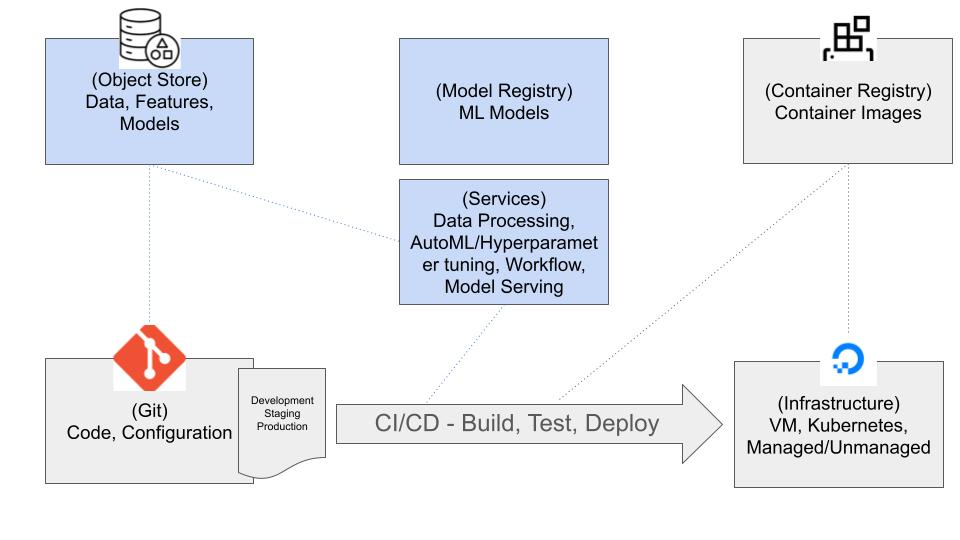
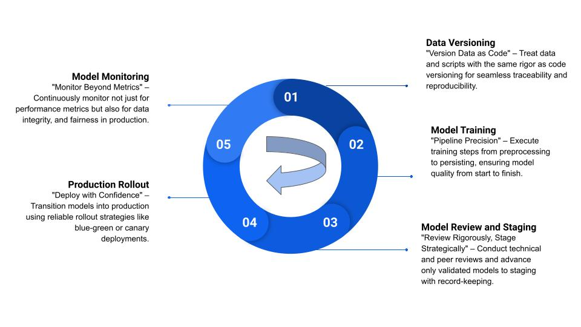

# Chapter 2 - MLOps and Developer Experience for Machine Learning

In the last chapter, we delved into the intricacies of GPUs, focusing on drivers, CUDA, and running sample applications. Now, Chapter 2 shifts the focus to the developer experience and operations (MLOps) in machine learning, contrasting it with traditional software development. We aim to provide insights and recommendations on building a practical, efficient workflow for machine learning development.

We will take a bottoms-up approach, starting with the developer first and outlining their day in life in ML workflow. 

## Pre-requisite
This chapter assumes that you have a basic understanding of software development processes and are familiar with fundamental concepts in machine learning.

## Traditional Software Development: A Developer's Perspective

The process of software development has evolved into a well-defined and mature system. The following diagram illustrates the typical flow of traditional software development:

1. **Primary Assets**: In traditional software development, the core assets are the code and its associated configuration settings.

2. **Source Control**: Git often serves as the source of truth, centralizing code and its version history.

3. **Code Review**: Before committing changes, developers typically undergo a code review process, ensuring quality and adherence to standards.

4. **Continuous Integration (CI)**: The CI process plays a crucial role, automatically running tests and building artifacts whenever code changes are made. This step is essential for maintaining code quality and functionality.

5. **Continuous Deployment (CD)**: As changes are approved and merged, CD mechanisms deploy these updates to production. This deployment can be manual or automated, and often employs strategies like feature flags, blue/green deployments, or canary releases to minimize disruptions and ensure stability.

## Machine Learning Development: Data Scientist/Developer Perspective

In contrast to traditional software development, machine learning development introduces unique challenges and complexities. Unlike traditional development, where the primary assets are code and configuration, machine learning development integrates additional critical components like data, model training, evaluation, and deployment.

### Day in the Life of a Data Scientist
A day in the life of a data scientist revolves around the central task of developing and refining machine learning models. These models are essentially a collection of optimized parameters and weights, relying on a blend of dataset and scripts for training and deployment.

#### Data Management and Experimentation
The journey of a data scientist typically begins with the crucial task of managing and preprocessing data. This process involves transforming raw data into a format suitable for analysis and model building, which can be both challenging and time-consuming. The volume of data managed by data scientists can range from a few megabytes to terabytes, presenting unique challenges in terms of storage, processing, and versioning.

A model is learned from data. Hence data versioning becomes essential for reproducibility and troubleshooting in machine learning projects. It helps in tracking changes, experimenting with different datasets, and ensuring consistency across various stages of model development.

Experimentation is a constant routine in machine learning model development. Prototyping and exploratory analysis are often done in interactive environments, enabling quick iterations and visualizations. However, tracking the performance history and maintaining reproducibility across potentially hundreds of experiments over time can be daunting. A centralized system for experiment tracking and model management is critical to maintain order and efficiency in this process.

Automating data management and experimentation tasks is a key strategy for enhancing productivity. Creating reproducible execution steps through automation not only saves time but also minimizes manual errors due to inconsistencies in software environments or dependencies.

#### Model Training and Hyperparameter Tuning
Model training is a core aspect of a data scientist's role, often requiring significant computational resources. This stage involves not just training the model but also fine-tuning various hyperparameters to optimize performance. The iterative nature of this process demands both patience and skill, as small adjustments in hyperparameters can significantly impact the model's effectiveness.

Once trained, the model is typically stored in a central repository, making it accessible for further testing, evaluation, or deployment.

#### Model Deployment and Monitoring
Deploying a trained model into a production environment is a critical phase, where the model transitions from a development setting to a real-world application. This phase often involves integrating the model into an existing product or service, requiring careful coordination and adherence to best practices in software development, including automated testing and deployment.

Continuous monitoring of the deployed model is vital to ensure it performs as expected over time. This involves tracking various performance metrics and being alert to changes in data patterns or user behavior that might affect the model's accuracy or efficiency.

#### Integration with Product Development
In an increasingly AI-driven world, machine learning is becoming a staple in product development across various industries. **Integrating machine learning development into existing software development workflows is not just a trend but a necessity for creating intelligent products**. This integration requires a deep understanding of both fields and a strategic approach to melding them effectively.

### ML Development Process

The following diagram illustrates the typical flow of ML software development. Key difference from software development being that data and models are the products.

1. **Data as a Core Asset**:
   - Data is the foundation of ML development, just like the source code in software engineering. It is gathered, cleaned, and transformed into a structured format that ML models can learn from.
   - Managing and versioning this data becomes important, ensuring that each experiment or model training run can be traced back to the specific dataset it used. 

2. **Experimentation and Model Training**:
   - ML development is iterative by nature, with continuous experimentation to fine-tune models, test hypotheses, and discover the most predictive features and algorithms.
   - Tools are employed to track these experiments, allowing data scientists to log configurations, algorithms, hyperparameters, and results systematically. This helps in identifying the most promising models that merit further development or deployment.

3. **Model Evaluation and Versioning**:
   - Trained models undergo rigorous evaluation to measure their performance against predefined metrics. Only those models that meet the set thresholds of accuracy, precision, recall, or other relevant metrics are considered for deployment.
   - Model versioning is crucial for managing the lifecycle of a model. It provides the capability to roll back to previous versions if needed and to understand the evolution of model performance over time.

4. **Deployment and Monitoring**:
   - Deploying ML models involves more than just releasing code; it requires the operationalization of the model within a production environment where it can infer from new data.
   - Monitoring is an ongoing process that ensures the model's performance remains high in live settings. It involves tracking the model's predictive power and watching for signs of model drift, data skew, or other issues that might necessitate retraining or model updates.

5. **Continuous Integration/Continuous Deployment (CI/CD)**:
   - The CI/CD pipeline extends beyond code integration and deployment in ML development. It includes the building, testing, and deployment of machine learning models as well as their associated data processing and serving services.
   - Automated pipelines help manage this flow, ensuring that new model versions are seamlessly integrated into production systems with minimal manual intervention.
   - A model registry is a centralized repository for storing trained models, often with version control. It acts as a single source of truth for the current and historical models that have been trained.
   - A container registry stores container images that encapsulate the model and its environment, ensuring consistency across different environments from development to production.
   - An object store is utilized for storing large volumes of data, model artifacts, and features. This often integrates with data version control systems to manage changes and history over time.

## Expanding CI/CD to Include ML Workflows (MLOps)
As businesses increasingly seek to enhance their products with ML capabilities, the seamless integration of ML workflows into the established development and operations frameworks becomes paramount. An ML model, particularly in the realm of LLMs, acts as a key value driver, offering advanced analytical and reasoning capabilities accessible through simple APIs. Below is an adaptable, opinionated framework designed to align ML workflows into traditional DevOps.

#### Stage 1: Data Versioning
- **Independent Exploration:** Data scientists often begin their journey in isolation, experimenting with various datasets and model designs. When a milestone is reached that demands thorough validation or intricate fine-tuning, a shift to structured development takes place.
- **Version Control for Data and Models:** At this pivotal stage, version control becomes vital. Every dataset, model configuration, and training script is meticulously tagged for identification, tracking, and future reproducibility. The use of a robust version control system is essential to handle the complexities of large datasets and model files, ensuring every aspect of the experiment, including environment configurations and dependencies, is preserved.

#### Stage 2: Model Building with CI
- **Engineering with CI:** The model-building process is a disciplined engineering task, encompassing the systematic preparation of data, the rigorous training of models, and the secure storage of the resulting binaries. Continuous Integration (CI) serves as the backbone of this process.
- **Automated ML Pipelines:** With each new data commit or script update, the CI system triggers an ML pipeline. This pipeline, which manages the sequence of steps necessary for model training, benefits from simplification through ML workflow management tools, allowing data scientists to focus on the critical tasks of data manipulation, parameter tuning, and algorithm optimization.
- **Rigorous Evaluation:** Following training, models undergo extensive testing against a suite of evaluation scripts designed to assess their performance rigorously. Only those models that withstand these evaluations are recorded in a model registry, with their related meta-information committed to version control, thus ensuring a detailed lineage of the model's development journey.

#### Stage 3: Model Review and Staging
- **Approval and Deployment:** The Continuous Deployment (CD) pipeline vigilantly observes for models that emerge successfully from evaluation and peer review. Approved models trigger deployment actions that usher them into a staging environment.
- **Staging and Real-World Testing:** In staging, models are subjected to real-world scenarios within a setup that closely mirrors the production environment. This stage is crucial for understanding the practical efficacy and impact of the model.
- **Hosting and Operational Management:** A sophisticated model hosting platform is then employed to serve the model, providing more than just inference capabilities. It also offers comprehensive monitoring of the model's operational metrics and health indicators.

#### Stage 4: Production Rollout
- **Gradual Release:** Those models that demonstrate excellence in the staging phase are carefully transitioned into the production environment. This is achieved through measured strategies such as canary releases or blue-green deployments, ensuring that the new model is introduced without disrupting the existing system.

#### Stage 5: Model Monitoring
- **Performance Monitoring:** Just as with any software product, an ML model consumes computational resources. Therefore, it is crucial to monitor its performance for factors like throughput, latency, and uptime.
- **Unique Monitoring Challenges:** Unlike software, which is code-driven, an ML model is data-driven. This distinction means that a model's behavior and performance are fundamentally shaped by the data on which it was trained. Consequently, model monitoring encompasses not only technical performance but also the quality and integrity of the data, fairness, and the model's explanatory power.
  - **Data Drift:** Any shift in the input data distribution can lead to decreased model accuracy.
  - **Concept Drift:** Evolving relationships between features and target variables can make previously learned patterns obsolete.
  - **Biases:** Unintended biases in training data can manifest in the model's predictions, necessitating vigilant monitoring to identify and address these issues.

These challenges are unique to ML and require a comprehensive monitoring strategy that includes mechanisms for model retraining and updating to maintain accuracy and relevance.

#### Need for Customization
MLOps is not a one-size-fits-all solution. While the framework outlined is comprehensive, it can be overkill for product teams starting new or where ML development need not be a first-class process. For example, a startup with limited resources might begin with simple data versioning and gradually incorporate automated model training pipelines as their data grows in complexity and volume. Integration of MLOps practices into existing development workflows can offer quick ROI without disrupting established processes.

Flexibility is key in MLOps. Teams should continuously assess their needs, scaling up their MLOps practices as their models become more sophisticated, data volumes increase, or the team expands. This gradual scaling ensures that MLOps practices grow in tandem with the team’s capabilities and project requirements, allowing for effective risk and resource management.

Ultimately, the goal of MLOps is to establish a process that not only aligns with the team's current operational landscape but also evolves dynamically with their aspirations and challenges. This tailored approach ensures that MLOps practices deliver value and drive efficiency in the most effective manner for each unique team and project.

## Select Open-source Tools for MLOps
The following table lists a few example tools for MLOps on Kubernetes. This list is by no means comprehensive. It is important to emphasize, start with the problems and adopt a tool only if needed.

| Tool           | Complexity         | Use Cases                                                                                      |
|----------------|--------------------|------------------------------------------------------------------------------------------------|
| DVC            | Moderate           | - Version control for large datasets and ML models - Efficient data storage and retrieval - Integration with Git for versioning - Reproducibility of ML experiments - Remote storage management (e.g., S3, GCP) - Support for multiple data versions in ML projects |
| MLflow         | Moderate           | - Tracking and logging of parameters, metrics, and models - ML model lifecycle management - Experiment tracking for reproducibility - Model registry for versioning and management - Deployment of models to various serving environments - Integration with popular ML frameworks (TensorFlow, PyTorch, etc.) |
| Metaflow       | Moderate to High   | - Building and managing data flows in ML projects - Scalable execution of models across various environments (local, cloud) - Versioning and tracking of data, code, and models - Easy orchestration of complex data science workflows - Support for containerization and various backends (AWS, etc.) - Enhanced reproducibility and debugging capabilities |
| Kubeflow       | High               | - End-to-end orchestration of ML workflows on Kubernetes - Scalable pipeline creation and execution - Hyperparameter tuning with Katib - Model serving with TF Serving, PyTorch Serve, etc. - Multi-framework support for diverse ML tasks - Centralized dashboard for managing ML workflows |
| Airflow        | Moderate to High   | - Automation and orchestration of complex workflows - Scheduling and monitoring of ML pipelines - Integration with diverse data sources and ML tools - Dynamic pipeline generation with Python - Customizable and extensible design - Management of task dependencies and execution order |
| Seldon Core    | Moderate to High   | - Scalable deployment of ML models in Kubernetes - Advanced deployment strategies (A/B testing, shadow deployment) - Model monitoring and logging - Rich inference graph with pre/post-processing - Integration with MLflow, Tensorflow, and other frameworks - Custom resource definitions for ML deployments in Kubernetes |

## Recommendations for ML Development Workflow
Machine learning integration varies significantly among product teams. Some are dedicated ML companies working on cutting-edge language models, while others might be employing ML more modestly to enhance their existing products. As the landscape of ML development is diverse, identifying and addressing key challenges is essential for an optimal development experience.

For teams new to machine learning, it is prudent to begin with a foundational set of tools, gradually expanding to more advanced systems as the complexity of your projects increases. **Starting with simplicity allows for a better grasp of ML development's unique challenges without the immediate complexity of the full spectrum of tools and methods.** Here is a set of progressive recommendations:

1. **Use Version Control**: Initiate your ML journey by adopting version control practices for both your datasets and models. Huggingface is akin to Github for LLMs- you can use Huggingface as a repository for your models and datasets. Another option is DVC. Tools like DVC can complement Git, providing a seamless version control system that extends to large data files and models, making Git the cornerstone for all your code, data, and model artifacts. 

2. **Incorporate a Model Lifecycle Platform**: As your project grows and model iteration becomes a more significant part of your workflow, consider integrating a model lifecycle platform (eg. MLflow). Such a platform can offer comprehensive features for tracking experiments, visualizing results, and monitoring models throughout their lifecycle, ensuring systematic progression from development to deployment.

3. **Expand Your Toolkit as Necessary**: As collaboration needs or computational demands increase, tools like notebooks for collaborative development and pipeline management can be invaluable (eg. Kubeflow). Additionally, for tasks requiring high-performance computing or distributed processing, exploring solutions like parallel computing frameworks (eg. Ray) can be advantageous.

The choices you make should be informed by your team's current expertise, familiarity with existing tools, and preference for either managed services or self-managed infrastructure. Managed services can offer convenience and scalability but may come with trade-offs in terms of cost and control.

The complexity of the ML component within your product also dictates the need for more sophisticated tooling. It's important to select tools that not only fit your current needs but are also flexible enough to scale with your project's growth.

Ultimately, the goal is to establish a workflow that aligns with your team's skill set, project requirements, and strategic vision, allowing for the smooth evolution of your ML capabilities.
